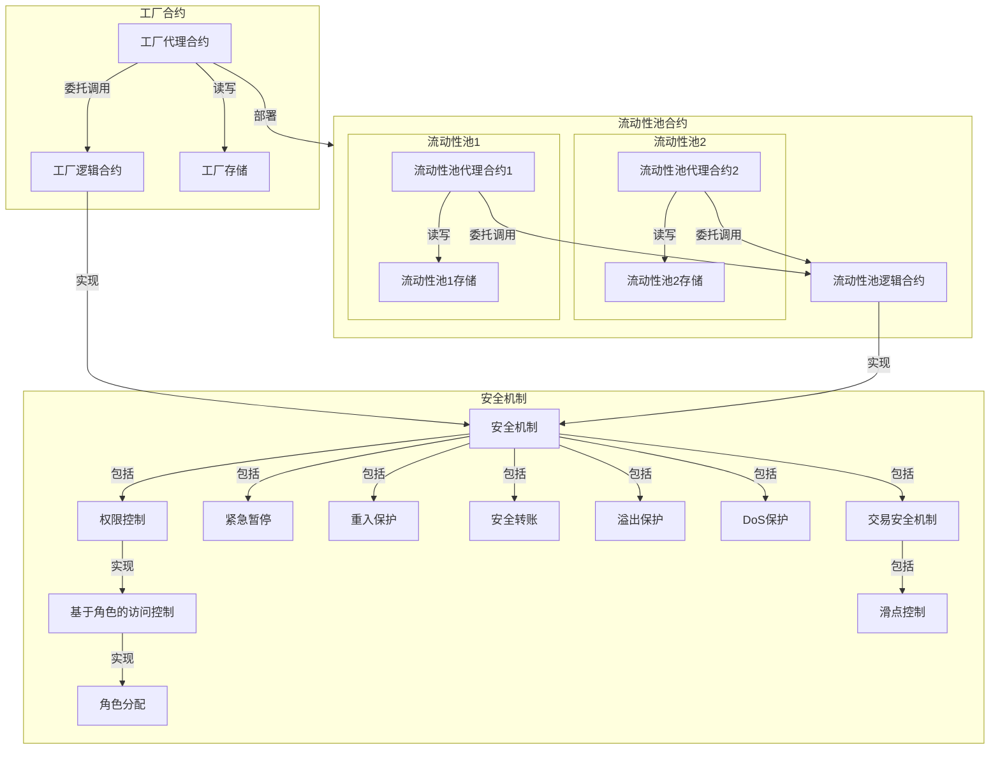

# HannesExchange 项目架构概述

## 1. 项目简介

HannesExchange 是一个基于恒定乘积自动做市商模式的去中心化交易所的智能合约实现，包含 `HannesExchangeV1` 和 `HannesExchangeV2` 两个版本：

- `HannesExchangeV1`：`ETH` 作为基础货币，只支持 `ETH ↔ ERC20` 直接兑换
- `HannesExchangeV2`：任意 `ERC20` 代币对，移除了 `ETH` 作为基础货币的限制

---

本项目架构概述文档描述了 Hannes Exchange V1 & V2 项目的**整体架构** ，**详细设计理念**和**开发理念**。

本项目的整体架构参考了 Uniswap V1 和 Uniswap V2 核心合约的架构，即 `Router - Factory - Pair/Pool` 架构。

本项目的 Case 文档中的**智能合约开发**一节中明确要求 AMM 的合约实现需要支持至少两种 `ETH ↔ ERC20` 兑换，即无需直接支持 `ERC20 ↔ ERC20` 兑换，因此无需实现用于 `ERC20 → ETH → ERC20` 的 `Router` 合约。

在考虑到以上需求，以及本项目所规定的有限时间和资源（7 天，独立开发）后，在项目规划和合约开发时，对 `Router - Factory - Pair/Pool` 架构进行了简化，形成了目前的 `Factory - Pair/Pool` 架构，因此：

- Hannes Exchange V1 可以理解为省略了 `Router` 合约的，用 Solidity 实现的，可升级的，更加安全的，实现了基于角色的访问控制的 Uniswap V1 的简化版合约实现（只支持 `ETH ↔ ERC20` ）。

- Hannes Exchange V2 可以理解为省略了 `Router` 合约的，用 Solidity 实现的，可升级的，更加安全的，实现了基于角色的访问控制的 Uniswap V2 的简化版合约实现（支持 `ERC20 ↔ ERC20` ）。

如需实现完整的 `Router - Factory - Pair/Pool` 架构，以及任意 `ERC20 ↔ ERC20` 的直接兑换功能，需要引入含 `ETH-warper` 逻辑的 `Router` 合约，和一个新的，只含 `ERC20 ↔ ERC20` 兑换逻辑的 LP 合约框架，该框架可以参考本项目中 [HannesExchangeV2Pair](../src/HannesExchangeV2Pair.sol) 和相应的工厂合约 [HannesExchangeV2Factory](../src/HannesExchangeV2Factory.sol) 的实现。

---

本项目的作者是 [Hannes Gao (hannesgao.eth)](https://github.com/hannesgao)。

## 2. 核心合约

Hannes Exchange V1 由两个核心功能合约组成：

### 2.1 工厂合约 (HannesExchangeV1Factory)

#### 2.1.1 结构和用途

- 工厂逻辑合约实现核心业务逻辑
- 工厂代理合约负责委托调用和升级管理（UUPS 代理模式）
- 工厂代理合约中的存储层维护 `ERC20 ↔ LP` 的映射关系，以及所有 LP 的列表

#### 2.1.2 状态变量管理

```solidity
mapping(address => address) public tokenToExchange;
mapping(address => address) public exchangeToToken;
mapping(uint256 => address) public idToToken;
address[] public allExchanges;
```

#### 2.1.3 部署流程

- 部署工厂逻辑合约
- 部署工厂代理合约并指向工厂逻辑合约
- 调用初始化函数设置角色

> 注¹：详细的工厂合约部署流程请参考 [DeployHannesExchangeV1Factory.s.sol](../script/DeployHannesExchangeV1Factory.s.sol) 中的部署脚本和注释 

> 注²：推荐使用 [openzeppelin-foundry-upgrades](https://docs.openzeppelin.com/upgrades-plugins/1.x/foundry-upgrades#deploy_a_proxy) 插件进行代理合约部署

### 2.2 流动性池合约 (HannesExchangeV1Pair)

#### 2.2.1 结构和用途

- 所有流动性池由工厂合约统一部署和管理
- 每个流动性池都拥有独立的逻辑合约和代理合约（UUPS 代理模式）
- 代理合约中存储层维护该流动性池的 ETH 储备、ERC20 代币 储备和 LP 代币供应量

> 注：在本项目语境中，`LP`，`Exchange`，`Pool`，`Pair`均为同一含义，即流动性池

#### 2.2.3 AMM 核心算法

```solidity
function getAmount(
    uint256 inputAmount,
    uint256 inputReserve,
    uint256 outputReserve
) public pure returns (uint256) {
    uint256 inputAmountWithFee = inputAmount * 997;  /// 0.3% 手续费
    uint256 numerator = inputAmountWithFee * outputReserve;
    uint256 denominator = (inputReserve * 1000) + inputAmountWithFee;
    return numerator / denominator;
}
```

#### 2.2.4 流动性管理

添加流动性：

- 首次添加：直接设置价格
- 后续添加：按比例计算
- 铸造 LP 代币给流动性提供者

移除流动性：

- 按比例计算返还金额
- 验证恒定乘积
- 销毁相应数量的 LP 代币

#### 2.2.5 部署流程

- 调用工厂代理合约创建初始流动性池

> 注¹：详细的流动性池部署流程请参考 [DeployHannesExchangeV1Pair.s.sol](../script/DeployHannesExchangeV1Pair.s.sol) 中的部署脚本和注释 

> 注²：推荐使用 [openzeppelin-foundry-upgrades](https://docs.openzeppelin.com/upgrades-plugins/1.x/foundry-upgrades#deploy_a_proxy) 插件进行代理合约部署

---

## 3. 合约架构

### 3.1 合约架构图示


--- 

### 3.2 合约模块间的交互流程

- 工厂代理合约负责部署新的流动性池代理合约 → 核心合约的可升级性，统一的流动性池管理
- 权限控制机制管理工厂和所有流动性池的访问权限 → 严格的角色和权限管理
- 合约安全机制在各个合约的关键操作中提供保护 → 完善的合约安全机制

---

## 4. 合约安全机制

### 4.1 高级权限控制：基于角色的访问控制

> 外部合约库¹：本项目使用 OpenZeppelin 的 AccessControlUpgradeable 库实现基于角色的权限控制  

> 外部合约库²：本项目使用 OpenZeppelin 的 Initializable 库实现多角色的初始化

#### 4.1.1 工厂合约的四个管理员角色

- 默认管理员：有最高权限，可以管理其他角色
- 升级管理员：有权限进行合约升级
- 暂停管理员：有权限紧急暂停合约（实现断路器功能）
- 流动性池管理员：有权限通过工厂代理合约部署新的流动性池

#### 4.1.2 流动性池合约的三个管理员角色

- 默认管理员：有最高权限，可以管理其他角色
- 升级管理员：有权限进行合约升级
- 暂停管理员：有权限紧急暂停合约（实现断路器功能）

> 注¹：工厂合约的管理员角色和流动性池合约的管理员角色之间是完全独立的  

> 注²：项目部署脚本中的管理员角色初始化部分仅为测试之用，请根据实际情况修改

---

### 4.2 应急措施：紧急暂停功能（断路器）

本项目实现紧急暂停功能的目的是：用于处理紧急安全事件，如漏洞发现，异常交易等，确保资产安全

> 外部合约库：本项目使用 OpenZeppelin 的 PausableUpgradeable 库实现紧急暂停功能（断路器）

#### 4.2.1 暂停管理员（PAUSER_ROLE）角色

- 有权限调用 `pause()` 和 `unpause()` 函数触发合约的紧急暂停机制
- 使用 `whenNotPaused` 修饰器控制关键功能函数的可用性
- 在发现安全问题时可快速响应，暂停合约关键功能函数，减少可能的损失

#### 4.2.2 被 `whenNotPaused` 修饰器保护的关键功能

- 新流动性池创建
- 添加/移除流动性
- 代币交换

> 注：应急暂停功能不应被滥用，不需要给所有函数都应用 `whenNotPaused` 修饰器，例如 `view` 或 `pure` 类型的函数。这些函数不会修改状态，因此不受暂停逻辑的限制

---

### 4.3 重入保护：通过状态锁定防止关键函数被重复调用

本项目实现重入保护目的是：防止在 ETH 转账或 ERC20 转账时可能发生的重入攻击，保护用户资产安全

> 外部合约库：本项目使用 OpenZeppelin 的 ReentrancyGuardUpgradeable 库实现重入保护

#### 4.3.1 重入保护的实现方式

- 工厂合约和流动性池合约需继承 OpenZeppelin 的 ReentrancyGuardUpgradeable 合约
- 使用 `nonReentrant` 修饰器控制关键功能函数的调用顺序
- 通过状态锁定防止重复调用

#### 4.3.2 重入保护的工作原理和流程

该流程的目的是：在函数执行期间，防止外部账户尝试重复调用该函数

- 使用 `nonReentrant` 修饰器的函数在执行前会被锁定某个私有状态变量（锁变量）
- 函数执行时该私有状态变量（锁变量）会被保持锁定，并等待函数执行完成
- 若在函数执行期间（即锁变量保持锁定期间），该函数被外部账户尝试调用，则抛出异常
- 函数执行完成后解除该私有状态变量（锁变量）的锁定状态

#### 4.3.3 重入保护的简单实现

```solidity
abstract contract ReentrancyGuard {
    /// 锁定状态变量
    uint256 private constant _NOT_ENTERED = 1;
    uint256 private constant _ENTERED = 2;
    uint256 private _status;

    modifier nonReentrant() {
        require(_status != _ENTERED, "ReentrancyGuard: reentrant call");
        _status = _ENTERED;
        _;  /// 执行函数逻辑
        _status = _NOT_ENTERED;
    }
}
```

---

### 4.4 安全转账：避免与非标准 ERC20 代币合约交互时导致的各种问题

> 外部合约库：本项目使用 OpenZeppelin 的 SafeERC20 库和 IERC20 接口实现安全转账

#### 4.4.1 项目中对安全转账的使用

使用继承了 SafeERC20 标准的 IERC20 代币接口，并在转账时调用 safeTransfer() 或 safeTransferFrom() 函数

```solidity
contract HannesExchangeV1Pair {
    using SafeERC20 for IERC20;  /// 引入库

    /// 添加流动性
    function addLiquidity() {
        IERC20(tokenAddress).safeTransferFrom(
            msg.sender,
            address(this),
            tokensAdded
        );
    }

    /// 代币交换
    function swapEthForTokens() {
        IERC20(tokenAddress).safeTransfer(recipient, tokenAmount);
    }
}
```

#### 4.4.2 安全转账在低级层面实现了：

- 合约存在性验证
- 使用低级 call 执行转账
- 调用成功性检查
- 返回值验证（处理非标准实现）

#### 4.4.3 不安全的转账：非标准 ERC20 代币合约可能会导致的问题

```solidity
/// 不安全的转账
bool success = token.transfer(to, amount);   /// 有些代币不遵循标准返回值
token.transferFrom(from, to, amount);        /// 有些代币在失败时不会revert
```

#### 4.4.4 安全转账：使用继承了 SafeERC20 标准的 IERC20 代币接口

```solidity
/// 安全转账 (SafeERC20)
IERC20(token).safeTransfer(to, amount);      /// 确保转账成功或revert
IERC20(token).safeTransferFrom(from, to, amount);
```

---

### 4.5 溢出/下溢保护：防止数值超过数据类型的数值限制，而导致数据偏差

> 外部合约库：本项目使用 OpenZeppelin 的 Math 库实现 min() 和 sqrt() 函数

#### 4.5.1 项目中使用的算数处理机制

- 恒定乘积公式优化：先乘后除，避免除法向下取整造成的精度损失

```solidity
function getAmount() {
    /// 先乘后除，避免精度损失
    uint256 numerator = inputAmountWithFee * outputReserve;
    uint256 denominator = (inputReserve * 1000) + inputAmountWithFee;
    return numerator / denominator;
}
```

- 使用 OpenZeppelin Math 库：节省 Gas 消耗，简化代码维护

```solidity
using Math for uint256;
/// 最小值计算
uint256 minLiquidity = Math.min(ethAmount, tokenAmount);
```

#### 4.5.2 Solidity 0.8.0+ 对于溢出检查的改进和 OpenZeppelin 的 SafeMath 库的废弃

在 Solidity 0.8.0 或更高版本中，其编译器内置了算数检查，在溢出/下溢的情况下会直接抛出编译错误，使得含有溢出/下溢隐患的合约会直接无法通过编译。另外，Solidity 编译器的算数检查机制直接在 EVM 操作码层面实现，比库调用更加高效，使得 SafeMath 库在大多数使用情况下变得多余。

因此，从 OpenZeppelin Contracts 5.0 开始，OpenZeppelin 正式从其合约库中移除了 SafeMath 库，出于类似原因，SignedSafeMath 库也被移除，本项目中也并未使用这两个库。

---

### 4.6 避免拒绝服务攻击

#### 4.6.1 避免因 Gas 限制攻击导致的拒绝服务

- 攻击描述：攻击者通过提交大量数据（如遍历数组），使得合约因超出Gas限制执行失败
- 攻击示例：一个遍历数组的函数可能在数据量非常大时超出Gas限制
- 项目代码中的防护实现示例：

```solidity
/// DoS防护：限制循环次数或输入数据大小，并总是检查输入数据
/// DoS防护：避免函数中需要遍历动态数组的逻辑
function getTokenWithId(uint256 _tokenId) public view returns (address) {
    require(_tokenId < allExchanges.length, "Invalid token ID");
    return idToToken[_tokenId];
}
```

#### 4.6.2 避免因重入攻击导致的拒绝服务

- 请参见 [4.3 重入保护](#43-重入保护通过状态锁定防止关键函数被重复调用)

#### 4.6.3 避免因外部调用失败导致的拒绝服务

- 攻击描述：攻击者部署恶意合约，调用后导致目标合约某些功能始终失败
- 攻击示例：攻击者提供一个有问题的合约地址，导致目标合约试图与之交互时失败
- 项目代码中的防护实现示例：

```solidity
/// DoS防护：使用 SafeTransfer 和安全的ETH转账
function removeLiquidity() {
    IERC20(tokenAddress).safeTransfer(msg.sender, tokenAmt);
    (bool success, ) = payable(msg.sender).call{value: ethAmount}("");
    require(success, "ETH transfer failed");
}
```

#### 4.6.4 避免因存储填充攻击导致的拒绝服务

- 攻击描述：攻击者使用合约中的存储操作（如映射或数组）不断写入数据，占用存储空间
- 攻击示例：恶意用户向合约反复发送含有新数据的交易，填满合约的存储容量
- 项目代码中的防护实现示例：

```solidity
/// Dos防护：各种输入数值检查，避免存储填充攻击
function addLiquidity() {
    require(msg.value > 0 && tokensAdded > 0, "Invalid values");
    require(totalSupply() > 0, "No liquidity");
    require(IERC20(tokenAddress).balanceOf(msg.sender) >= tokensAdded);
}
/// DoS防护：基于用户的访问控制也能有效避免存储填充攻击
```

### 4.7 交易安全机制

#### 4.7.1 滑点保护：防止大额交易造成大幅价格波动

```solidity
function swapEthForTokens(uint256 minTokens) {
    uint256 tokenAmount = getAmount(...);
    /// 滑点保护：确保实际获得的代币数量不低于用户设定的最小值
    require(tokenAmount >= minTokens, "Insufficient output amount");
}

function swapTokenForEth(uint256 tokensSold, uint256 minEth) {
    uint256 ethAmount = getEthAmount(tokensSold);
    /// 滑点保护：确保实际获得的ETH数量不低于用户设定的最小值
    require(ethAmount >= minEth, "Insufficient output amount");
}
```

#### 4.7.2 交易费用计算

```solidity
function getAmount() {
   /// 交易费用：收取0.3%手续费，用于激励做市商提供流动性，同时减少套利空间
   uint256 inputAmountWithFee = inputAmount * 997;
   /// 使用先乘后除的顺序避免精度损失
   uint256 numerator = inputAmountWithFee * outputReserve;
   uint256 denominator = (inputReserve * 1000) + inputAmountWithFee;
}
```

#### 4.7.3 恒定乘积检查

```solidity
function removeLiquidity() {
   /// 恒定乘积检查：确保移除流动性后的储备金比例不会偏离，防止价格操纵
   require(
       (tokenReserve * ethBalance) >= 
       ((tokenReserve - tokenAmt) * (ethBalance - ethAmount)),
       "Invariant check failed"
   );
}
```

#### 4.7.4 储备金检查

```solidity
function getAmount() {
   /// 储备金检查：确保流动性池中有足够的流动性进行交易
   require(
       inputReserve > 0 && outputReserve > 0,
       "Insufficient reserve"
   );
   /// ...
}
```

#### 4.7.5 余额检查

```solidity
function addLiquidity() {
   /// 余额检查：确保用户有足够的代币进行操作，防止交易失败
   require(
       IERC20(tokenAddress).balanceOf(msg.sender) >= tokensAdded,
       "Insufficient token balance"
   );
}
```

#### 4.7.6 零值检查

```solidity
function getTokenAmount(uint256 ethSold) {
   /// 零值检查：防止无效交易和除零错误
   require(ethSold > 0, "ETH sold must be greater than 0");
}
```

#### 4.7.7 安全转账

```solidity
/// ETH转账使用call而不是transfer，避免gas限制问题
/// 同时捕获转账失败的情况
(bool success, ) = payable(msg.sender).call{value: ethAmount}("");
require(success, "ETH transfer failed");

/// 使用SafeERC20库进行代币转账，处理非标准ERC20实现和失败情况
IERC20(tokenAddress).safeTransfer(recipient, tokenAmount);
```

- 请参见 [4.4 安全转账](#44-安全转账避免与非标准-erc20-代币合约交互时导致的各种问题)

#### 4.7.8 流动性验证

```solidity
function removeLiquidity() {
   /// 流动性验证：确保移除的数量有效且池子中有流动性
   require(tokenAmount > 0, "Invalid token amount");
   require(totalSupply() > 0, "No liquidity");

   /// 防止在同一区块内，先移除流动性再添加以操纵价格
   require(block.timestamp > lastRemoveTime + MIN_DELAY, "Too frequent");
}
```

---

## 5. 合约的升级

### 5.1 通用可升级代理（UUPS Proxy）

#### 5.1.1 基本架构

- 包含一个代理合约（Proxy）和一个逻辑合约（Implementation）
- 所有对代理合约的调用通过 `delegatecall` 转发到逻辑合约
- 代理合约：存储数据和状态，以及逻辑合约的地址
- 逻辑合约：包含核心业务逻辑和升级函数


#### 5.1.2 与传统代理模式的主要区别

- 升级函数位于逻辑合约而不是代理合约中，可以解决选择器冲突问题
- 代理合约不含升级函数，从而更加轻量，可以节省升级所用的燃料费用
- 升级函数可以在逻辑合约的新版本中被移除，可以提供更好的安全性

#### 5.1.2 适用性分析

- 可以实现更细粒度的访问控制，便于实现角色基础的访问控制
- 支持复杂的存储结构变更，适合需要长期运行且可能进行多次升级的合约

### 5.2 实现细节

> 外部合约库：本项目使用 OpenZeppelin 的 UUPSUpgradeable 库实现通用可升级代理 

- 继承 `UUPSUpgradeable`
- 使用 `_authorizeUpgrade()` 函数控制升级权限
- 采用 `initialize()` 函数代替构造函数:

#### 5.2.1 初始化函数替代构造函数
```solidity
contract HannesExchangeV1Pair is
    UUPSUpgradeable
{
    /// @custom:oz-upgrades-unsafe-allow constructor
    constructor() {
        _disableInitializers();  /// 防止逻辑合约被再次初始化
    }

    function initialize(
        address _tokenAddress,
        address _admin,
        address _upgrader,
        address _pauser
    ) public initializer {
        __AccessControl_init();
        __Pausable_init();
        __ReentrancyGuard_init();
        __UUPSUpgradeable_init();
        
        /// ... 初始化状态变量
    }
}
```

#### 5.2.2 升级权限控制

```solidity
function _authorizeUpgrade(address newImplementation) 
    internal 
    override 
    onlyRole(UPGRADER_ROLE) 
{
    /// 仅允许UPGRADER_ROLE执行升级
}
```

#### 5.2.3 版本管理

```solidity
function version() public pure virtual returns (string memory) {
    return "1.0.0";  /// 用于验证升级
}
```

#### 5.2.4 实现通用可升级代理时的最佳实践

- 使用可升级的基础合约（如 OpenZeppelin 的 UUPSUpgradeable 库）
- 不在逻辑合约中定义不可变量（`immutable` 类型变量）
- 在多个版本的逻辑合约中尽可能地保持原状态变量布局

### 5.3 部署和升级

#### 5.3.1 部署流程
```solidity
/// 1. 部署逻辑合约
HannesExchangeV1Factory factory = new HannesExchangeV1Factory();

/// 2. 准备初始化数据
bytes memory initData = abi.encodeWithSelector(
    HannesExchangeV1Factory.initialize.selector,
    admin,
    upgrader,
    pauser,
    creator
);

/// 3. 部署代理合约
ERC1967Proxy proxy = new ERC1967Proxy(
    address(factory),
    initData
);
```

#### 5.3.2 升级流程

> 注¹：详细的升级流程请参考 [UpgradeToHannesExchangeTestTokenV2.s.sol](../script/upgradeable-test-token-scripts/UpgradeToHannesExchangeTestTokenV2.s.sol) 中的升级脚本和注释  

> 注²：推荐使用 [openzeppelin-foundry-upgrades](https://docs.openzeppelin.com/upgrades-plugins/1.x/foundry-upgrades#upgrade_a_proxy_or_beacon) 插件进行合约升级  

- 部署新逻辑合约
- 验证新合约兼容性
- 升级代理合约指向
- 验证版本更新

> 注³：本项目中的 [src/upgradeable-test-token](../src/upgradeable-test-token) 和 [script/upgradeable-test-token-scripts](../script/upgradeable-test-token-scripts) 文件夹中包含了一套完整的可升级 ERC20 代币合约，一个简单的 ERC20 代币合约及其部署和升级脚本，用于测试 UUPS 代理以及给流动性池合约提供用于初始化的 ERC20 代币合约实例

### 5.5 升级时关于安全的最佳实践

#### 5.5.1 避免存储冲突
- 遵循 [OpenZeppelin 升级插件文档](https://docs.openzeppelin.com/upgrades-plugins/1.x/foundry-upgrades) 中的建议
- 使用预留存储槽为升级预留空间
- 不删除现有状态变量

#### 5.5.2 初始化保护
- 禁用逻辑合约的构造器
- 使用 `initializer` 修饰符防止重复初始化
- 验证初始化参数
