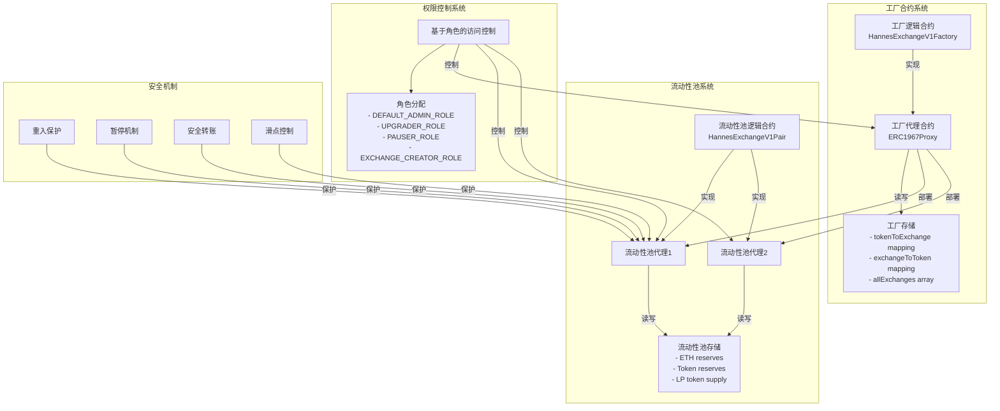

# Hannes Exchange V1 项目架构概述

## 简介

本项目架构概述文档描述了 Hannes Exchange V1 项目的整体架构和详细设计理念。

本项目的整体架构参考了 Uniswap V1 和 Uniswap V2 核心合约的架构，即 `Router - Factory - Pair/Pool` 架构。

本项目的 Case 文档中的 **智能合约开发** 一节中明确要求 AMM 的合约实现需要支持至少两种 `ETH ↔ ERC20` 兑换，即无需直接支持 `ERC20 ↔ ERC20` 兑换，因此无需实现用于 `ERC20 → ETH → ERC20` 的 `Router` 合约。

在考虑到上述需求，以及项目实现所规定的有限时间和资源（7 天，独立开发）后，在项目规划和合约开发时，我对 `Router - Factory - Pair/Pool` 架构进行了简化，形成了目前的 `Factory - Pair/Pool` 架构。

本项目可以理解为省略了 `Router` 合约的，用 Solidity 实现的，可升级的，更加安全的，实现了基于角色的访问控制的 Uniswap V1 的简化版合约实现。

如需实现完整的 `Router - Factory - Pair/Pool` 架构，以及任意 `ERC20 ↔ ERC20` 的直接兑换功能，需要引入含 `ETH-warper` 逻辑的 `Router` 合约，和一个新的，只含`ERC20 ↔ ERC20` 兑换逻辑的 LP 合约框架，该框架可以参考 HannesExchangeV2Pair 中的实现。

## 合约架构

Hannes Exchange V1 的整体架构由两个主要核心功能合约组成：

### 工厂合约 (HannesExchangeV1Factory)

1. 工厂逻辑合约实现核心业务逻辑
2. 工厂代理合约负责委托调用和升级管理
3. 存储层维护 Token 与 Exchange 地址的映射关系，以及所有流动性池的列表

### 流动性池合约

- 所有流动性池由工厂合约统一部署和管理
- 每个流动性池都有独立的逻辑合约实现和代理合约
- 存储包括 ETH 储备、Token 储备和 LP 代币供应量

## 安全功能

### 权限控制：

- 基于 OpenZeppelin 的 RBAC (Role Based Access Control)
- 四个关键角色：
  - 管理员：最高权限，可以管理其他角色
  - 升级者：负责合约升级
  - 暂停者：可以紧急暂停合约
  - 交易对创建者：可以通过工厂部署新的交易对

4. 安全机制：

- 重入保护：防止重入攻击
- 暂停机制：紧急情况下停止合约
- 安全转账：使用 SafeERC20
- 滑点控制：防止大额交易造成大幅价格波动

系统间的交互流程：

1. 工厂代理合约负责部署新的流动性池代理
2. 权限控制系统管理工厂和所有流动性池的访问权限
3. 安全机制在各个合约的关键操作中提供保护

这种分层设计实现了：

- 合约的可升级性
- 严格的权限管理
- 完善的安全防护
- 统一的交易对管理



## 核心合约技术细节

### 1. 工厂合约 (HannesExchangeV1Factory)

#### 状态管理

```solidity
mapping(address => address) public tokenToExchange;
mapping(address => address) public exchangeToToken;
mapping(uint256 => address) public idToToken;
address[] public allExchanges;
```

#### 可升级性实现

- 继承`UUPSUpgradeable`
- 使用`_authorizeUpgrade`函数控制升级权限
- 采用`initialize`代替构造函数:

```solidity
function initialize(
    address _admin,
    address _upgrader,
    address _pauser,
    address _exchangeCreator
) public initializer
```

#### 流动性池创建流程

1. 部署新的逻辑合约实例
2. 编码初始化参数
3. 部署代理合约
4. 更新状态映射
5. 发出事件通知

### 2. 流动性池合约 (HannesExchangeV1Pair)

#### AMM 核心算法

```solidity
function getAmount(
    uint256 inputAmount,
    uint256 inputReserve,
    uint256 outputReserve
) public pure returns (uint256) {
    uint256 inputAmountWithFee = inputAmount * 997;  // 0.3% 手续费
    uint256 numerator = inputAmountWithFee * outputReserve;
    uint256 denominator = (inputReserve * 1000) + inputAmountWithFee;
    return numerator / denominator;
}
```

#### 安全措施

1. 重入保护

```solidity
modifier nonReentrant
```

2. 紧急暂停

```solidity
modifier whenNotPaused
```

3. ETH 转账保护

```solidity
(bool success, ) = payable(msg.sender).call{value: ethAmount}("");
require(success, "ETH transfer failed");
```

4. 代币转账保护

```solidity
using SafeERC20 for IERC20;
IERC20(tokenAddress).safeTransfer(recipient, tokenAmount);
```

#### 流动性管理

1. 添加流动性

   - 首次添加：直接设置价格
   - 后续添加：按比例计算
   - LP 代币铸造逻辑

2. 移除流动性
   - 按比例计算返还金额
   - 验证恒定乘积
   - LP 代币销毁

## 前端技术实现

### 1. Vue + Vuetify 组件结构

```
src/
├── components/
│   ├── ExchangeComponent/
│   │   ├── SwapInterface.vue
│   │   ├── LiquidityInterface.vue
│   │   └── PriceChart.vue
│   ├── WalletConnect.vue
│   └── Common/
├── composables/
│   ├── useWeb3.ts
│   └── useExchange.ts
└── views/
    ├── Swap.vue
    ├── Pool.vue
    └── CreatePool.vue
```

### 2. Web3 交互实现

```typescript
// useExchange.ts
import { useContractWrite, useContractRead } from "wagmi";
import { exchangeABI } from "@/contracts/abis";

export function useSwap() {
  const swap = useContractWrite({
    address: EXCHANGE_ADDRESS,
    abi: exchangeABI,
    functionName: "swapEthForTokens",
  });

  return {
    swap,
    // ... other functions
  };
}
```

## 部署流程详解

### 1. 合约部署序列

1. 部署工厂逻辑合约
2. 部署代理合约并指向逻辑合约
3. 调用初始化函数设置角色
4. 创建初始流动性池

### 2. Foundry 部署脚本

```solidity
// script/Deploy.s.sol
contract DeployScript is Script {
    function run() external {
        // 部署工厂逻辑合约
        HannesExchangeV1Factory factory = new HannesExchangeV1Factory();

        // 准备初始化数据
        bytes memory initData = abi.encodeWithSelector(
            HannesExchangeV1Factory.initialize.selector,
            admin,
            upgrader,
            pauser,
            creator
        );

        // 部署代理合约
        ERC1967Proxy proxy = new ERC1967Proxy(
            address(factory),
            initData
        );
    }
}
```

## 测试策略细节

### 1. 单元测试

```solidity
// test/Factory.t.sol
contract FactoryTest is Test {
    function testCreateExchange() public {
        // 设置测试环境
        vm.startPrank(exchangeCreator);

        // 创建交易对
        address exchange = factory.createExchange(
            tokenAddress,
            admin,
            upgrader,
            pauser
        );

        // 验证创建结果
        assertTrue(factory.getExchange(tokenAddress) == exchange);
        assertTrue(factory.getToken(exchange) == tokenAddress);
    }
}
```

### 2. 属性测试

```solidity
// test/Exchange.t.sol
contract ExchangeTest is Test {
    function testInvariant_ConstantProduct(
        uint256 ethAmount
    ) public {
        vm.assume(ethAmount > 0.01 ether && ethAmount < 100 ether);

        uint256 k = exchange.getTokenReserves() * address(exchange).balance;
        // 执行交换
        exchange.swapEthForTokens{value: ethAmount}(0, address(this));
        // 验证k值未降低
        assertTrue(
            exchange.getTokenReserves() * address(exchange).balance >= k
        );
    }
}
```
