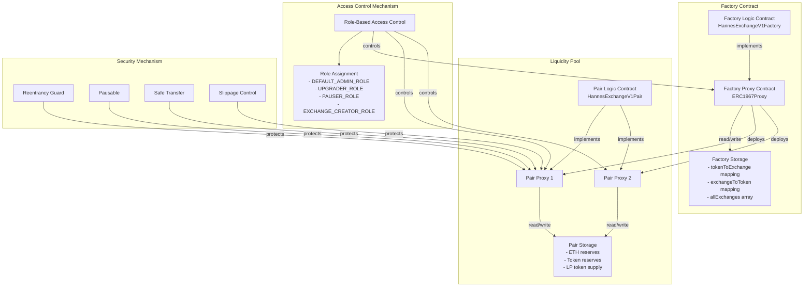

# Hannes Exchange V1 & V2 Project Architectural Overview

## 1. Project Introduction

This project architectural overview document describes the **overall architecture**, **detailed design principles**, and **development philosophy** of the Hannes Exchange V1 project.

The overall architecture of this project references the core contract architecture of Uniswap V1 and Uniswap V2, namely the `Router - Factory - Pair/Pool` architecture.

The Case document's **Smart Contract Development** section explicitly requires that the AMM contract implementation should support at least two types of `ETH ↔ ERC20` exchanges, without needing to directly support `ERC20 ↔ ERC20` exchanges, thus eliminating the need for a `Router` contract for `ERC20 → ETH → ERC20` exchanges. 

Considering these requirements and the project's limited time and resources (7 days, independent development), the project planning and contract development simplified the `Router - Factory - Pair/Pool` architecture into the current `Factory - Pair/Pool` architecture, therefore:

- Hannes Exchange V1 can be understood as a simplified version of Uniswap V1 implemented in Solidity, omitting the `Router` contract, with upgradeable functionality, enhanced security, and role-based access control implementation. ( `ETH ↔ ERC20` only)

- Hannes Exchange V2 can be understood as a simplified version of Uniswap V2 implemented in Solidity, omitting the `Router` contract, with upgradeable functionality, enhanced security, and role-based access control implementation. ( `ERC20 ↔ ERC20` supported)

To implement a complete `Router - Factory - Pair/Pool` architecture and direct `ERC20 ↔ ERC20` exchange functionality, it would require introducing a `Router` contract with `ETH-wrapper` logic and a new LP contract framework containing only `ERC20 ↔ ERC20` exchange logic, which could reference the implementation of HannesExchangeV2Factory and HannesExchangeV2Pair in this project.

This project's author is [Hannes Gao (hannesgao.eth)](https://github.com/hannesgao).

## 2. Core Contracts

Hannes Exchange V1 consists of two core functional contracts:

### 2.1 Factory Contract (HannesExchangeV1Factory)

#### 2.1.1 Structure and Purpose

- Factory logic contract implements core business logic
- Factory proxy contract handles delegate calls and upgrade management (UUPS proxy pattern)
- Factory proxy contract's storage layer maintains `ERC20 ↔ LP` mapping relationships and a list of all LPs

#### 2.1.2 State Variable Management

```solidity
mapping(address => address) public tokenToExchange;
mapping(address => address) public exchangeToToken;
mapping(uint256 => address) public idToToken;
address[] public allExchanges;
```

#### 2.1.3 Deployment Process

- Deploy factory logic contract
- Deploy factory proxy contract pointing to factory logic contract
- Call initialization function to set roles

> Note¹: For detailed factory contract deployment process, refer to [DeployHannesExchangeV1Factory.s.sol](../script/DeployHannesExchangeV1Factory.s.sol) deployment script and comments

> Note²: Recommended to use [openzeppelin-foundry-upgrades](https://docs.openzeppelin.com/upgrades-plugins/1.x/foundry-upgrades#deploy_a_proxy) plugin for proxy contract deployment

### 2.2 Liquidity Pool Contract (HannesExchangeV1Pair)

#### 2.2.1 Structure and Purpose

- All liquidity pools are deployed and managed uniformly by the factory contract
- Each liquidity pool has its own logic contract and proxy contract (UUPS proxy pattern)
- Proxy contract's storage layer maintains ETH reserves, ERC20 token reserves, and LP token supply for that liquidity pool

> Note: In this project context, `LP`, `Exchange`, `Pool`, and `Pair` all refer to the same thing: liquidity pool

#### 2.2.3 AMM Core Algorithm

```solidity
function getAmount(
    uint256 inputAmount,
    uint256 inputReserve,
    uint256 outputReserve
) public pure returns (uint256) {
    uint256 inputAmountWithFee = inputAmount * 997;  /// 0.3% fee
    uint256 numerator = inputAmountWithFee * outputReserve;
    uint256 denominator = (inputReserve * 1000) + inputAmountWithFee;
    return numerator / denominator;
}
```

#### 2.2.4 Liquidity Management

Adding Liquidity:

- Initial addition: Set price directly
- Subsequent additions: Calculate proportionally
- Mint LP tokens to liquidity provider

Removing Liquidity:

- Calculate return amounts proportionally
- Verify constant product
- Burn corresponding amount of LP tokens

#### 2.2.5 Deployment Process

- Call factory proxy contract to create initial liquidity pool

> Note¹: For detailed liquidity pool deployment process, refer to [DeployHannesExchangeV1Pair.s.sol](../script/DeployHannesExchangeV1Pair.s.sol) deployment script and comments

> Note²: Recommended to use [openzeppelin-foundry-upgrades](https://docs.openzeppelin.com/upgrades-plugins/1.x/foundry-upgrades#deploy_a_proxy) plugin for proxy contract deployment

---

## 3. Contract Architecture

### 3.1 Contract Architecture Diagram


--- 

### 3.2 Contract Module Interaction Flow

- Factory proxy contract handles deployment of new liquidity pool proxy contracts → Core contract upgradeability, unified liquidity pool management
- Access control mechanism manages access permissions for factory and all liquidity pools → Strict role and permission management
- Contract security mechanisms provide protection in key operations across contracts → Comprehensive contract security mechanisms

---

## 4. Contract Security Mechanisms

### 4.1 Advanced Access Control: Role-Based Access Control

> External Contract Library¹: This project uses OpenZeppelin's AccessControlUpgradeable library to implement role-based access control

> External Contract Library²: This project uses OpenZeppelin's Initializable library to implement multi-role initialization

#### 4.1.1 Factory Contract's Four Admin Roles

- Default Admin: Has highest privileges, can manage other roles
- Upgrade Admin: Has permission to upgrade contracts
- Pause Admin: Has permission to emergency pause contracts (implements circuit breaker)
- Liquidity Pool Admin: Has permission to deploy new liquidity pools through factory proxy contract

#### 4.1.2 Liquidity Pool Contract's Three Admin Roles

- Default Admin: Has highest privileges, can manage other roles
- Upgrade Admin: Has permission to upgrade contracts
- Pause Admin: Has permission to emergency pause contracts (implements circuit breaker)

> Note¹: Admin roles between factory contract and liquidity pool contract are completely independent

> Note²: Admin role initialization in project deployment scripts is for testing only, please modify according to actual needs

---

### 4.2 Emergency Measures: Emergency Pause Function (Circuit Breaker)

This project implements emergency pause functionality to: handle emergency security events such as vulnerability discoveries and abnormal transactions, ensuring asset safety

> External Contract Library: This project uses OpenZeppelin's PausableUpgradeable library to implement emergency pause functionality (circuit breaker)

#### 4.2.1 Pause Admin (PAUSER_ROLE) Role

- Has permission to call `pause()` and `unpause()` functions to trigger contract emergency pause mechanism
- Uses `whenNotPaused` modifier to control availability of key function functions
- Can quickly respond to security issues by pausing critical contract functions to minimize potential losses

#### 4.2.2 Key Functions Protected by `whenNotPaused` Modifier

- New liquidity pool creation
- Adding/removing liquidity
- Token exchange

> Note: Emergency pause functionality should not be abused; not all functions need the `whenNotPaused` modifier, e.g., `view` or `pure` type functions. These functions don't modify state and thus aren't restricted by pause logic

---

### 4.3 Reentrancy Protection: Prevent Critical Functions from Being Called Repeatedly Through State Locking

This project implements reentrancy protection to: prevent reentrancy attacks that might occur during ETH or ERC20 transfers, protecting user assets

> External Contract Library: This project uses OpenZeppelin's ReentrancyGuardUpgradeable library to implement reentrancy protection

#### 4.3.1 Reentrancy Protection Implementation Method

- Factory and liquidity pool contracts inherit OpenZeppelin's ReentrancyGuardUpgradeable contract
- Use `nonReentrant` modifier to control calling sequence of key functions
- Prevent repeated calls through state locking

#### 4.3.2 Reentrancy Protection Working Principle and Process

This process aims to: prevent external accounts from attempting to repeatedly call a function during its execution

- Functions using `nonReentrant` modifier are locked by a private state variable (lock variable) before execution
- During function execution, private state variable (lock variable) remains locked and waits for function completion
- If function is attempted to be called by external account during execution (while lock variable remains locked), exception is thrown
- After function completion, private state variable (lock variable) lock status is released

#### 4.3.3 Simple Reentrancy Protection Implementation

```solidity
abstract contract ReentrancyGuard {
    /// Lock state variable
    uint256 private constant _NOT_ENTERED = 1;
    uint256 private constant _ENTERED = 2;
    uint256 private _status;

    modifier nonReentrant() {
        require(_status != _ENTERED, "ReentrancyGuard: reentrant call");
        _status = _ENTERED;
        _;  /// Execute function logic
        _status = _NOT_ENTERED;
    }
}
```

---

### 4.4 Safe Transfer: Avoid Issues When Interacting with Non-Standard ERC20 Token Contracts

> External Contract Library: This project uses OpenZeppelin's SafeERC20 library and IERC20 interface to implement safe transfers

#### 4.4.1 Safe Transfer Usage in Project

Use IERC20 token interface inheriting SafeERC20 standard and call safeTransfer() or safeTransferFrom() functions for transfers

```solidity
contract HannesExchangeV1Pair {
    using SafeERC20 for IERC20;  /// Import library

    /// Add liquidity
    function addLiquidity() {
        IERC20(tokenAddress).safeTransferFrom(
            msg.sender,
            address(this),
            tokensAdded
        );
    }

    /// Token exchange
    function swapEthForTokens() {
        IERC20(tokenAddress).safeTransfer(recipient, tokenAmount);
    }
}
```

#### 4.4.2 Safe Transfer Implements at Low Level:

- Contract existence verification
- Use low-level call for transfers
- Call success check
- Return value verification (handle non-standard implementations)

#### 4.4.3 Unsafe Transfers: Potential Issues with Non-Standard ERC20 Token Contracts

```solidity
/// Unsafe transfers
bool success = token.transfer(to, amount);   /// Some tokens don't follow standard return values
token.transferFrom(from, to, amount);        /// Some tokens don't revert on failure
```

#### 4.4.4 Safe Transfers: Using IERC20 Token Interface Inheriting SafeERC20 Standard

```solidity
/// Safe transfers (SafeERC20)
IERC20(token).safeTransfer(to, amount);      /// Ensures transfer success or reverts
IERC20(token).safeTransferFrom(from, to, amount);
```

---

### 4.5 Overflow/Underflow Protection: Prevent Data Deviation Due to Values Exceeding Data Type Limits

> External Contract Library: This project uses OpenZeppelin's Math library to implement min() and sqrt() functions

#### 4.5.1 Arithmetic Processing Mechanisms Used in Project

- Constant Product Formula Optimization: Multiply first then divide to avoid precision loss from division rounding down

```solidity
function getAmount() {
    /// Multiply first then divide to avoid precision loss
    uint256 numerator = inputAmountWithFee * outputReserve;
    uint256 denominator = (inputReserve * 1000) + inputAmountWithFee;
    return numerator / denominator;
}
```

- Using OpenZeppelin Math Library: Save Gas consumption, simplify code maintenance

```solidity
using Math for uint256;
/// Minimum value calculation
uint256 minLiquidity = Math.min(ethAmount, tokenAmount);
```

#### 4.5.2 Solidity 0.8.0+ Improvements in Overflow Checks and Deprecation of OpenZeppelin's SafeMath Library

In Solidity 0.8.0 or higher versions, the compiler has built-in arithmetic checks that throw compilation errors in case of overflow/underflow, making contracts with overflow/underflow vulnerabilities fail compilation directly. Additionally, Solidity compiler's arithmetic check mechanism is implemented directly at the EVM opcode level, making it more efficient than library calls, making the SafeMath library redundant in most use cases.

Therefore, starting from OpenZeppelin Contracts 5.0, OpenZeppelin officially removed the SafeMath library from their contract library. For similar reasons, the SignedSafeMath library was also removed, and neither library is used in this project.

---

#### 4.6.2 Avoiding DoS Through Reentrancy Attacks

- Please refer to [4.3 Reentrancy Protection](#43-reentrancy-protection-preventing-critical-functions-from-being-called-repeatedly-through-state-locking)

#### 4.6.3 Avoiding DoS Through Failed External Calls

- Attack Description: Attackers deploy malicious contracts that cause certain functionalities of the target contract to consistently fail
- Attack Example: Attacker provides a problematic contract address, causing the target contract to fail when attempting to interact with it
- Implementation Example of Protection in Project Code:

```solidity
/// DoS Protection: Using SafeTransfer and secure ETH transfers
function removeLiquidity() {
    IERC20(tokenAddress).safeTransfer(msg.sender, tokenAmt);
    (bool success, ) = payable(msg.sender).call{value: ethAmount}("");
    require(success, "ETH transfer failed");
}
```

#### 4.6.4 Avoiding DoS Through Storage Stuffing Attacks

- Attack Description: Attackers continuously write data using contract storage operations (like mappings or arrays) to occupy storage space
- Attack Example: Malicious users repeatedly send transactions with new data to fill up the contract's storage capacity
- Implementation Example of Protection in Project Code:

```solidity
/// DoS Protection: Various input value checks to prevent storage stuffing attacks
function addLiquidity() {
    require(msg.value > 0 && tokensAdded > 0, "Invalid values");
    require(totalSupply() > 0, "No liquidity");
    require(IERC20(tokenAddress).balanceOf(msg.sender) >= tokensAdded);
}
/// DoS Protection: User-based access control can also effectively prevent storage stuffing attacks
```

### 4.7 Transaction Security Mechanisms

#### 4.7.1 Slippage Protection: Preventing Large Price Fluctuations from Large Transactions

```solidity
function swapEthForTokens(uint256 minTokens) {
    uint256 tokenAmount = getAmount(...);
    /// Slippage Protection: Ensure actual tokens received are not less than user-specified minimum
    require(tokenAmount >= minTokens, "Insufficient output amount");
}

function swapTokenForEth(uint256 tokensSold, uint256 minEth) {
    uint256 ethAmount = getEthAmount(tokensSold);
    /// Slippage Protection: Ensure actual ETH received is not less than user-specified minimum
    require(ethAmount >= minEth, "Insufficient output amount");
}
```

#### 4.7.2 Transaction Fee Calculation

```solidity
function getAmount() {
   /// Transaction Fee: Charge 0.3% fee to incentivize market makers and reduce arbitrage opportunities
   uint256 inputAmountWithFee = inputAmount * 997;
   /// Multiply first then divide to avoid precision loss
   uint256 numerator = inputAmountWithFee * outputReserve;
   uint256 denominator = (inputReserve * 1000) + inputAmountWithFee;
}
```

#### 4.7.3 Constant Product Check

```solidity
function removeLiquidity() {
   /// Constant Product Check: Ensure reserve ratio doesn't deviate after liquidity removal
   /// Prevents price manipulation
   require(
       (tokenReserve * ethBalance) >= 
       ((tokenReserve - tokenAmt) * (ethBalance - ethAmount)),
       "Invariant check failed"
   );
}
```

#### 4.7.4 Reserve Check

```solidity
function getAmount() {
   /// Reserve Check: Ensure sufficient liquidity in pool for trading
   require(
       inputReserve > 0 && outputReserve > 0,
       "Insufficient reserve"
   );
   /// ...
}
```

#### 4.7.5 Balance Check

```solidity
function addLiquidity() {
   /// Balance Check: Ensure user has sufficient tokens, prevent transaction failure
   require(
       IERC20(tokenAddress).balanceOf(msg.sender) >= tokensAdded,
       "Insufficient token balance"
   );
}
```

#### 4.7.6 Zero Value Check

```solidity
function getTokenAmount(uint256 ethSold) {
   /// Zero Value Check: Prevent invalid transactions and division by zero errors
   require(ethSold > 0, "ETH sold must be greater than 0");
}
```

#### 4.7.7 Safe Transfer

```solidity
/// Use call instead of transfer for ETH transfers to avoid gas limit issues
/// Also capture transfer failure cases
(bool success, ) = payable(msg.sender).call{value: ethAmount}("");
require(success, "ETH transfer failed");

/// Use SafeERC20 library for token transfers to handle non-standard ERC20 implementations
/// and failure cases
IERC20(tokenAddress).safeTransfer(recipient, tokenAmount);
```

- Please refer to [4.4 Safe Transfer](#44-safe-transfer-avoiding-issues-when-interacting-with-non-standard-erc20-token-contracts)

#### 4.7.8 Liquidity Validation

```solidity
function removeLiquidity() {
   /// Liquidity Validation: Ensure removal amount is valid and pool has liquidity
   require(tokenAmount > 0, "Invalid token amount");
   require(totalSupply() > 0, "No liquidity");

   /// Prevent price manipulation by removing and adding liquidity in the same block
   require(block.timestamp > lastRemoveTime + MIN_DELAY, "Too frequent");
}
```

---

## 5. Contract Upgrades

### 5.1 Universal Upgradeable Proxy Standard (UUPS Proxy)

#### 5.1.1 Basic Architecture

- Includes a proxy contract (Proxy) and a logic contract (Implementation)
- All calls to the proxy contract are forwarded to the logic contract via `delegatecall`
- Proxy Contract: Stores data, state, and the logic contract address
- Logic Contract: Contains core business logic and upgrade functions

#### 5.1.2 Key Differences from Traditional Proxy Pattern

- Upgrade functions are in the logic contract rather than the proxy contract, resolving selector clash issues
- Proxy contract contains no upgrade functions, making it lighter and saving gas costs for upgrades
- Upgrade functions can be removed in new versions of the logic contract, providing better security

#### 5.1.3 Suitability Analysis

- Enables more granular access control, facilitating role-based access control
- Supports complex storage structure changes, suitable for long-running contracts that may require multiple upgrades

### 5.2 Implementation Details

> External Contract Library: This project uses OpenZeppelin's UUPSUpgradeable library to implement the Universal Upgradeable Proxy

- Inherits from `UUPSUpgradeable`
- Uses `_authorizeUpgrade()` function to control upgrade permissions
- Adopts `initialize()` function instead of constructor:

#### 5.2.1 Initialization Function Replacing Constructor
```solidity
contract HannesExchangeV1Pair is
    UUPSUpgradeable
{
    /// @custom:oz-upgrades-unsafe-allow constructor
    constructor() {
        _disableInitializers();  /// Prevent logic contract from being reinitialized
    }

    function initialize(
        address _tokenAddress,
        address _admin,
        address _upgrader,
        address _pauser
    ) public initializer {
        __AccessControl_init();
        __Pausable_init();
        __ReentrancyGuard_init();
        __UUPSUpgradeable_init();
        
        /// ... Initialize state variables
    }
}
```

#### 5.2.2 Upgrade Permission Control

```solidity
function _authorizeUpgrade(address newImplementation) 
    internal 
    override 
    onlyRole(UPGRADER_ROLE) 
{
    /// Only UPGRADER_ROLE can perform upgrades
}
```

#### 5.2.3 Version Management

```solidity
function version() public pure virtual returns (string memory) {
    return "1.0.0";  /// For upgrade verification
}
```

#### 5.2.4 Best Practices When Implementing UUPS

- Use upgradeable base contracts (like OpenZeppelin's UUPSUpgradeable library)
- Don't define immutable variables in logic contracts
- Maintain original state variable layout across multiple versions of logic contracts when possible

### 5.3 Deployment and Upgrades

#### 5.3.1 Deployment Process
```solidity
/// 1. Deploy logic contract
HannesExchangeV1Factory factory = new HannesExchangeV1Factory();

/// 2. Prepare initialization data
bytes memory initData = abi.encodeWithSelector(
    HannesExchangeV1Factory.initialize.selector,
    admin,
    upgrader,
    pauser,
    creator
);

/// 3. Deploy proxy contract
ERC1967Proxy proxy = new ERC1967Proxy(
    address(factory),
    initData
);
```

#### 5.3.2 Upgrade Process

> Note¹: For detailed upgrade process, please refer to [UpgradeToHannesExchangeTestTokenV2.s.sol](../script/upgradeable-test-token-scripts/UpgradeToHannesExchangeTestTokenV2.s.sol) for upgrade scripts and comments

> Note²: Recommended to use [openzeppelin-foundry-upgrades](https://docs.openzeppelin.com/upgrades-plugins/1.x/foundry-upgrades#upgrade_a_proxy_or_beacon) plugin for contract upgrades

- Deploy new logic contract
- Verify new contract compatibility
- Upgrade proxy contract pointer
- Verify version update

> Note³: The [src/upgradeable-test-token](../src/upgradeable-test-token) and [script/upgradeable-test-token-scripts](../script/upgradeable-test-token-scripts) folders in this project contain a complete set of upgradeable ERC20 token contracts, a simple ERC20 token contract and its deployment and upgrade scripts, used for testing UUPS proxy and providing ERC20 token contract instances for initializing liquidity pool contracts

### 5.5 Security Best Practices for Upgrades

#### 5.5.1 Avoiding Storage Conflicts
- Follow recommendations in the [OpenZeppelin Upgrades Plugin documentation](https://docs.openzeppelin.com/upgrades-plugins/1.x/foundry-upgrades)
- Use reserved storage slots for future upgrades
- Don't delete existing state variables

#### 5.5.2 Initialization Protection
- Disable logic contract constructors
- Use `initializer` modifier to prevent repeated initialization
- Validate initialization parameters